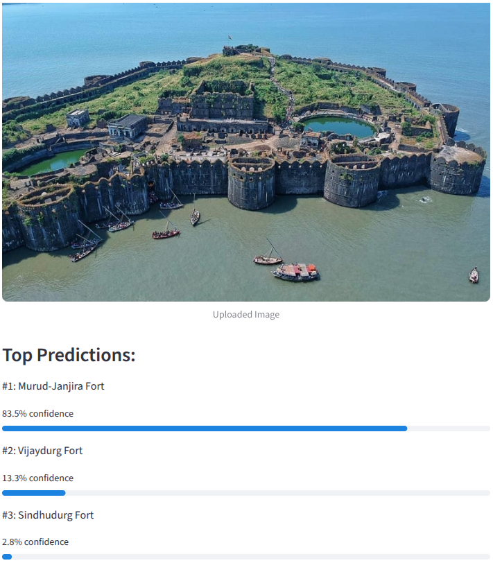

# Maharashtra Forts Image Classifier

A Streamlit-based web application that identifies famous forts of Maharashtra from uploaded images using OpenAI CLIP zero-shot image classification.Upload a photo of a Maharashtra fort and the app predicts which fort it is, along with its history, timings, entry fee, and Google Maps link.

## Features
- Upload any image (JPG, JPEG, PNG) of a Maharashtra fort
- Zero-shot classification using OpenAI CLIP
- Displays top 3 predictions with confidence scores
- Shows history, visiting timings, and entry fee of the predicted fort
- Direct Google Maps link for the predicted fort
- Streamlit-based interactive UI

## Supported Forts

The classifier currently supports the following Maharashtra forts:

- Raigad Fort
- Rajgad Fort
- Pratapgad Fort
- Ahmednagar Fort
- Lohagad Fort
- Shivneri Fort
- Sindhudurg Fort
- Murud-Janjira Fort
- Vijaydurg Fort
- Sinhagad Fort
- Daulatabad Fort
- Panhala Fort

## Technologies Used
- Python
- Streamlit
- PyTorch
- OpenAI CLIP
- Transformers
- Pillow

## Model Used
- **CLIP (openai/clip-vit-base-patch32)** — a zero-shot vision-language model by OpenAI that matches images to text descriptions without any training.

## How It Works
1. User uploads an image of a Maharashtra fort
2. The CLIP processor converts both image and text prompts into embeddings.
3. Similarity scores are computed between the image and fort prompts.
4. Prompt scores are averaged for each fort.
5. Softmax probabilities generate the final predictions.
6. Top-3 predictions and fort metadata are displayed.

## Screenshots

### Homepage


### Prediction Demo



### Metadata Display


## Run Locally

Clone the repository:

```bash
git clone https://github.com/Havinash-5/Maharashtra-fort-classifier.git
cd Maharashtra-fort-classifier
```

Install dependencies:

```bash
pip install -r requirements.txt
```

Run the app:

```bash
streamlit run app.py
```